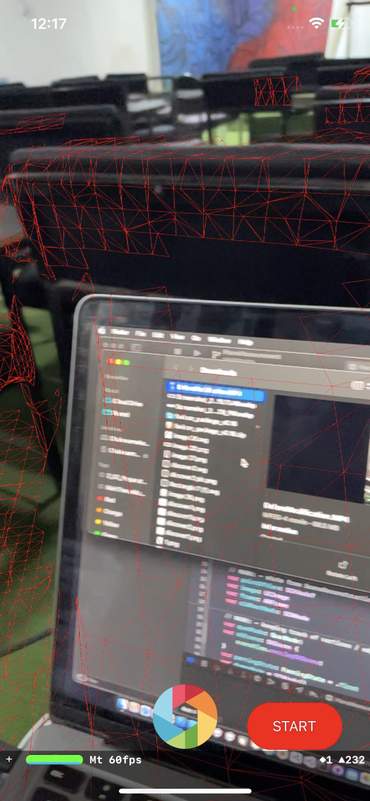

# mesh-scan-app

iOS Augmented Reality with Xcode and Swift

# How to Install

- Launch the project using Xcode.
- Connect your iPhone device to Xcode.
- Once you device is visible, Click on the Play button to start the process of installing the applicaiton on your iPhone.

# Improvements on the App

### What I did:

To improve the Measurement Screen I did the following:

### 1. Issues with Contrast:

I noticed that the Lines and Node where in color Blue and the Text was in faded white which made it very hard to see the content of the text. To improve on this I changed the color to the following;

- For the Nodes and Line, the color is: WHITE
- For the Text, the color is: BLACK

### Before Improvement image

### After Improvement image

### 2. No Instruction to guide the User:

I noticed also that there were no instructions to guide the users on what to do, so I added an Instruction at the top of the screen that shows up immediately the user launches the DrawRulerViewController (the Measurement Screen). Once the user touches the screen to place their first measurement node, the Instruction disappears.

### Before Improvement image

### After Improvement image

### 3. User Feedback:

I added Haptic Feedback to the app. The haptic feedback triggers anytime the user adds or edits the measurement nodes.

### 4. Reset Button:

I added a Reset Button that will allow the user to reset their measurement or erase their measurement.

### Before Improvement image

### After Improvement image

### 5. Added Icon to the Shutter Button:

Previously the shutter button was just a Blue circle, I decided to change that to a Shutter icon that is more descriptive of what the button is meant to do.

These were the improvements I was able to do within the Time frame I had,

### Before Improvement image

### After Improvement image

<!--  -->
